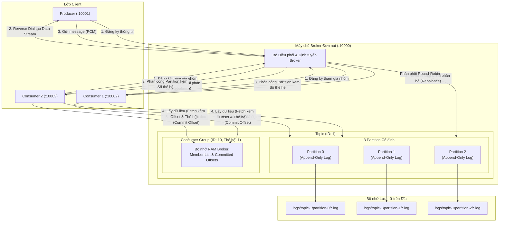
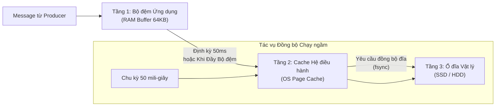
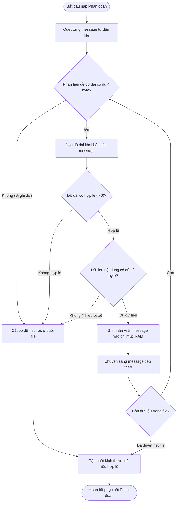
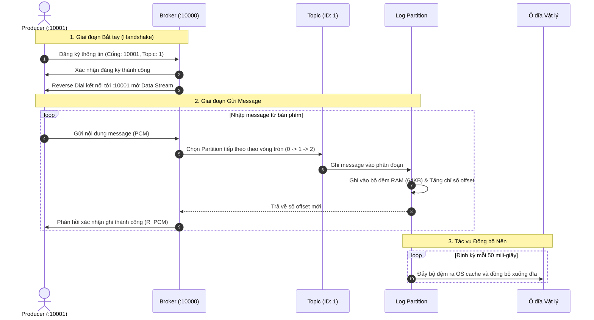
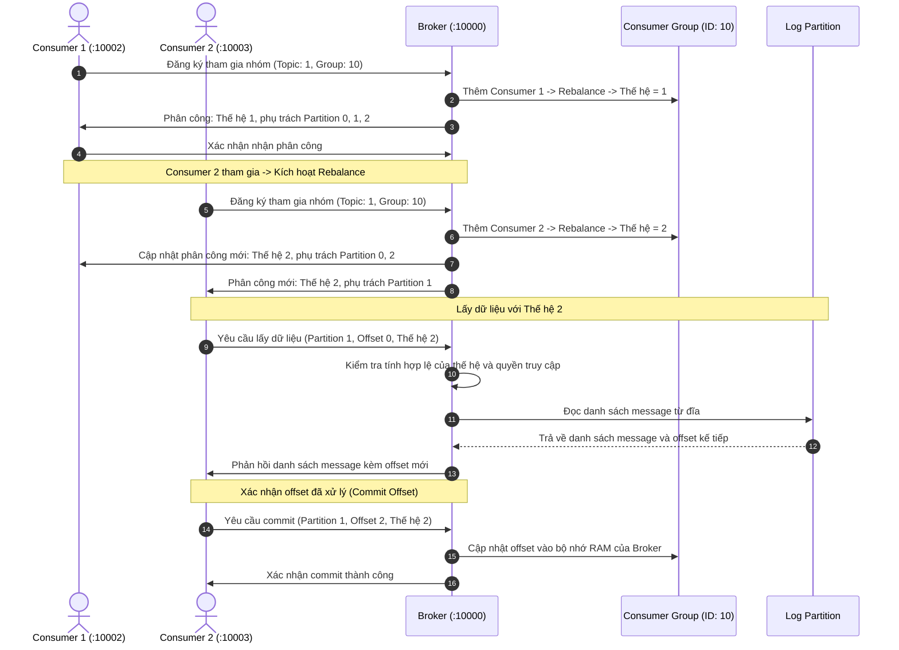
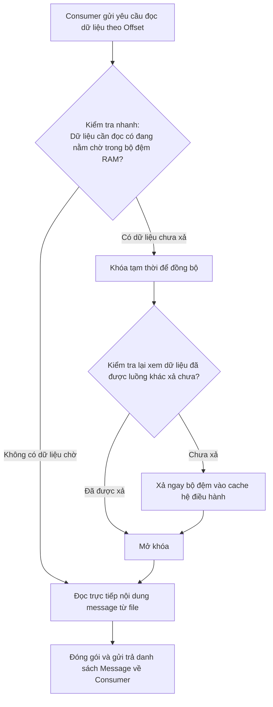

# DistributedMQ 🚀

[](https://golang.org)
[](https://kafka.apache.org)
[]()
[]()
[]()

**DistributedMQ** là một dự án nghiên cứu học tập viết bằng Go, mô phỏng các khái niệm cốt lõi của một message queue phân tán theo phong cách **Apache Kafka** trên mô hình **máy chủ đơn nút (Single-Broker)** ở mức tối giản và trực quan:

- **Broker**: Tiếp nhận message từ Producer, định tuyến vào các Partition và điều phối dữ liệu cho Consumer.
- **Topic & Partition**: Mỗi Topic hiện được khởi tạo với 3 Partition cố định, quản lý lưu trữ phân đoạn độc lập trên ổ đĩa.
- **Consumer Group**: Tự động cân bằng tải Partition cho các Consumer theo thuật toán vòng tròn (Round-Robin).
- **Lưu trữ Phân đoạn trên Đĩa**: Message được ghi nối tiếp vào các file log (Append-Only Log), có cơ chế khôi phục các bản ghi hợp lệ sau sự cố crash.
- **Đồng bộ Đĩa Đa tầng**: Kết hợp bộ đệm ứng dụng, bộ đệm hệ điều hành cùng cơ chế flush định kỳ và graceful shutdown để giảm thiểu nguy cơ mất dữ liệu.
- **Kiểm soát Thế hệ (Generation)**: Từ chối các request dùng generation cũ, giảm thiểu xung đột giữa các thế hệ Consumer sau khi Rebalance.

---

## 📌 Trạng thái Dự án (Project Status)

> [!NOTE]
> **Dự án phục vụ mục đích nghiên cứu & học tập (Educational Prototype)**
> 
> DistributedMQ được xây dựng như một công cụ học tập để tìm hiểu về kiến trúc lưu trữ log, giao thức mạng nhị phân cấp thấp, và cơ chế rebalance nhóm consumer. Dự án **chưa sẵn sàng cho môi trường production** và có các đặc điểm phạm vi sau:
> - **Mô hình Single-Broker**: Chạy trên một tiến trình Broker duy nhất; hiện tại chưa hỗ trợ cụm phân tán đa broker (Clustering), cơ chế đồng thuận phân tán (Raft / KRaft) hay sao lưu bản sao (Data Replication).
> - **Lưu trữ Phân tầng**: Message log được lưu trên đĩa (`AppendOnlyLog`), nhưng các metadata trạng thái gồm danh sách Topic, danh sách thành viên Consumer Group và Committed Offset hiện được lưu trong bộ nhớ RAM của Broker và sẽ bị đặt lại khi tiến trình khởi động lại.
> - **Mô hình Kết nối Đảo chiều (Reverse Dial)**: Broker chủ động kết nối ngược lại cổng listener của Client để thiết lập luồng dữ liệu riêng biệt.
> - **Số lượng Partition**: Hiện được cấu hình cố định 3 partition cho mỗi Topic để phục vụ kịch bản minh họa rebalance.

---

## 📑 Mục lục

- [Tổng quan kiến trúc](#-tổng-quan-kiến-trúc)
- [Thiết kế Kết nối Hai chiều (Reverse Dial)](#-thiết-kế-kết-nối-hai-chiều-reverse-dial)
- [Chi tiết các cơ chế cốt lõi](#-chi-tiết-các-cơ-chế-cốt-lõi)
  - [1. Lưu trữ Log Phân đoạn trên Ổ đĩa (Segmented Append-Only Log)](#1-lưu-trữ-log-phân-đoạn-trên-ổ-đĩa-segmented-append-only-log)
  - [2. Quy trình Ghi đĩa 3 Tầng & Cơ chế Flush Định kỳ](#2-quy-trình-ghi-đĩa-3-tầng--cơ-chế-flush-định-kỳ)
  - [3. Cơ chế Khôi phục Bản ghi Hợp lệ sau Crash](#3-cơ-chế-khôi-phục-bản-ghi-hợp-lệ-sau-crash)
  - [4. Tái phân bổ Nhóm Consumer & Xác thực Thế hệ](#4-tái-phân-bổ-nhóm-consumer--xác-thực-thế-hệ)
- [Sơ đồ luồng hoạt động (Workflow Diagrams)](#-sơ-đồ-luồng-hoạt-động-workflow-diagrams)
  - [Luồng Gửi Message từ Producer](#luồng-gửi-message-từ-producer)
  - [Luồng Consumer, Rebalance & Lấy Dữ liệu](#luồng-consumer-rebalance--lấy-dữ-liệu)
  - [Cơ chế Kiểm tra Bộ đệm khi Đọc Dữ liệu](#cơ-chế-kiểm-tra-bộ-đệm-khi-đọc-dữ-liệu)
- [Giao thức Mạng Nhị phân (TCP Protocol)](#-giao-thức-mạng-nhị-phân-tcp-protocol)
- [Cấu trúc Thư mục & Mã nguồn](#-cấu-trúc-thư-mục--mã-nguồn)
- [Cài đặt & Hướng dẫn sử dụng](#-cài-đặt--hướng-dẫn-sử-dụng)
- [Mô hình Đa luồng & An toàn Dữ liệu](#-mô-hình-đa-luồng--an-toàn-dữ-liệu)
- [So sánh với Apache Kafka](#-so-sánh-với-apache-kafka)
- [Giới hạn & Định hướng Phát triển](#-giới-hạn--định-hướng-phát-triển)

---

## 🏛 Tổng quan kiến trúc



---

## 🔌 Thiết kế Kết nối Hai chiều (Reverse Dial)

Trong các message broker truyền thống (như Kafka hoặc RabbitMQ), client thường chủ động mở một kết nối socket dài hạn tới broker để truyền nhận dữ liệu. Tuy nhiên, DistributedMQ áp dụng mô hình **bắt tay hai chiều (Bidirectional Reverse Dial)**:

1. **Kênh Điều khiển (Control Channel)**: Producer hoặc Consumer mở một TCP listener tại cổng cục bộ của mình, sau đó gửi một gói tin đăng ký (Registration) tới cổng `:10000` của Broker.
2. **Kênh Dữ liệu Riêng biệt (Dedicated Data Stream)**: Sau khi ghi nhận cổng của client, Broker chủ động gọi `net.Dial` ngược lại cổng listener đó để thiết lập một luồng truyền dữ liệu độc lập.

> [!TIP]
> **Lý do lựa chọn thiết kế này:**
> - **Phân tách luồng xử lý**: Tách biệt rõ ràng giữa giai đoạn đăng ký cấu hình ban đầu và luồng trao đổi dữ liệu liên tục trong runtime.
> - **Broker chủ động quản lý luồng**: Giúp Broker toàn quyền kiểm soát vòng đời kết nối dữ liệu của từng client trong môi trường nghiên cứu local.
> - *Lưu ý*: Thiết kế này yêu cầu các Client phải mở được port lắng nghe kết nối trên cùng mạng cục bộ (Local Network).

---

## 🔍 Chi tiết các cơ chế cốt lõi

### 1. Lưu trữ Log Phân đoạn trên Ổ đĩa (Segmented Append-Only Log)

- **Vấn đề trước đây**: Message được lưu trong hàng đợi bộ nhớ RAM. Khi tiến trình Broker tắt, dữ liệu chưa đọc sẽ bị mất.
- **Cơ chế hiện tại**: Chuyển sang mô hình lưu trữ ghi nối tiếp trên đĩa theo từng phân đoạn:
  - **Phân chia theo từng Segment**: Dữ liệu của mỗi Partition được chia nhỏ thành các file phân đoạn với dung lượng tối đa mặc định là **10 MiB** cho mỗi file.
    ```text
    logs/topic-<topicID>/partition-<partitionID>/
    ├── 000000000000.log    # Phân đoạn 1 (bắt đầu từ offset 0)
    ├── 000000000150.log    # Phân đoạn 2 (bắt đầu từ offset 150)
    └── 000000000300.log    # Phân đoạn đang ghi (nhận message mới nhất)
    ```
  - **Tên file tự động định thứ tự**: Tên file log được đặt theo offset bắt đầu của phân đoạn và đệm đủ 12 chữ số (`000000000000.log`). Khi Broker nạp danh sách file từ thư mục, việc sắp xếp theo bảng chữ cái sẽ tự động trùng với thứ tự tăng dần của offset theo thời gian.
  - **Chỉ mục bộ nhớ tra cứu tức thời**: Mỗi phân đoạn duy trì một bảng chỉ mục vị trí byte trong RAM. Khi Consumer yêu cầu đọc một offset bất kỳ, hệ thống tính toán được ngay tọa độ byte trên đĩa để đọc trực tiếp mà không cần quét tuần tự file.
  - **Đọc song song không tranh chấp con trỏ**: Thao tác đọc được thực hiện trực tiếp tại tọa độ byte xác định mà không làm dịch chuyển con trỏ đọc chung của file, cho phép nhiều Consumer có thể đọc đồng thời từ cùng một phân đoạn mà không gây xung đột con trỏ đọc.
  - **Tự động chuyển phân đoạn mới (Segment Rolling)**: Khi một message mới làm phân đoạn hiện tại vượt quá 10 MiB, hệ thống tự động yêu cầu đẩy dữ liệu ra đĩa, khóa phân đoạn cũ sang chế độ chỉ đọc và mở phân đoạn mới để tiếp tục nhận dữ liệu.

### 2. Quy trình Ghi đĩa 3 Tầng & Cơ chế Flush Định kỳ

Để đạt được thông lượng xử lý cao mà không làm chậm trễ thời gian phản hồi cho Producer, quy trình ghi dữ liệu được tổ chức theo đường ống dẫn 3 tầng:



- **Tầng 1 - Bộ đệm ứng dụng**: Dữ liệu mới trước hết được gom vào vùng nhớ tạm 64KB để giảm thiểu số lượng lời gọi hệ thống (system call).
- **Tầng 2 - Bộ đệm hệ điều hành (OS Page Cache)**: Định kỳ hoặc khi bộ đệm ứng dụng đầy, dữ liệu được đẩy sang vùng nhớ đệm của hệ điều hành, giúp Broker hoàn tất nhanh phản hồi cho Producer.
- **Tầng 3 - Ổ cứng vật lý**: Hệ thống phát lệnh `fsync` để yêu cầu hệ điều hành đẩy dữ liệu từ cache xuống lớp lưu trữ vật lý.
- **Tiến trình chạy ngầm định kỳ**: Một tác vụ nền tự động thực hiện đồng bộ dữ liệu xuống đĩa sau mỗi **50 mili-giây**, giúp cân bằng giữa độ trễ phản hồi và việc giảm thiểu nguy cơ mất dữ liệu.
- **Tắt hệ thống an toàn (Graceful Shutdown)**: Khi Broker nhận lệnh dừng, hệ thống sẽ phát tín hiệu ngắt tác vụ nền và đợi tác vụ này xả sạch dữ liệu còn tồn đọng xuống đĩa trước khi đóng file descriptor.

### 3. Cơ chế Khôi phục Bản ghi Hợp lệ sau Crash

Nếu máy chủ gặp sự cố dừng đột ngột hoặc mất điện giữa lúc đang ghi, phần cuối của file log có thể chứa các message bị đứt quãng. Mỗi khi khởi động, Broker sẽ rà soát các phân đoạn log:



- **Nhận diện dữ liệu dang dở**: Hệ thống kiểm tra từng khối tin gồm 4 byte tiêu đề độ dài và nội dung tương ứng. Nếu tiêu đề bị ngắt quãng hoặc nội dung không đủ số lượng byte khai báo, hệ thống nhận diện đây là phần dữ liệu lỗi do crash.
- **Cắt tỉa an toàn (Truncation)**: File sẽ được cắt bỏ chính xác ngay tại điểm bắt đầu của bản ghi lỗi, khôi phục các bản ghi hợp lệ trước đó và đưa phân đoạn về trạng thái ổn định để nhận dữ liệu mới.

### 4. Tái phân bổ Nhóm Consumer & Xác thực Thế hệ

Khi số lượng Consumer trong nhóm thay đổi, Broker sẽ phân chia lại 3 Partition. Để giảm thiểu rủi ro xung đột dữ liệu do trễ mạng hoặc Consumer cũ gửi yêu cầu muộn (hiện tượng Zombie Consumer):

- **Bộ đếm thế hệ (Generation Counter)**: Mỗi Consumer Group duy trì một số thế hệ tăng dần. Mỗi lần diễn ra quá trình tái phân bổ (Rebalance), số thế hệ này tự động tăng thêm 1 đơn vị.
- **Phân bổ theo vòng tròn (Round-Robin)**: 3 partition được chia đều cho danh sách các Consumer đang hoạt động trong nhóm.
- **Xác thực thế hệ**:
  - Consumer bắt buộc phải gửi kèm số thế hệ mà mình đang nắm giữ trong mọi yêu cầu lấy dữ liệu (Fetch) hoặc xác nhận đã đọc (Commit Offset).
  - Broker sẽ đối chiếu số thế hệ này và **từ chối các request dùng generation cũ** nếu nhóm đã bước sang thế hệ mới.
  - Đồng thời, Broker kiểm tra quyền phân công để đảm bảo Consumer chỉ thao tác trên đúng những partition mà nó được giao trong thế hệ hiện tại.

---

## 🔄 Sơ đồ luồng hoạt động (Workflow Diagrams)

### Luồng Gửi Message từ Producer



### Luồng Consumer, Rebalance & Lấy Dữ liệu



### Cơ chế Kiểm tra Bộ đệm khi Đọc Dữ liệu

Khi Producer vừa gửi message mới và message đó đang nằm trong bộ đệm RAM mà chưa đến chu kỳ đồng bộ đĩa 50ms, Consumer gửi yêu cầu đọc ngay lập tức sẽ được hệ thống xử lý:



---

## 📦 Giao thức Mạng Nhị phân (TCP Protocol)

DistributedMQ sử dụng định dạng gói tin nhị phân chuẩn Big-Endian:

```text
+-----------------------+-------------------+-----------------------------------+
|  Length (4 Bytes)     |   Type (1 Byte)   |        Payload (N Bytes)          |
|      uint32           |       uint8       |        Dữ liệu theo loại gói tin  |
+-----------------------+-------------------+-----------------------------------+
```

- **Length**: Kích thước tính bằng byte của trường Loại thông điệp (`Type`, 1 byte) và phần dữ liệu (`Payload`, $N$ bytes).
- **Type**: Mã số nhận diện loại thông điệp.
- **Payload**: Khối dữ liệu nhị phân chứa các tham số chi tiết.

### Bảng tra cứu Mã Thông điệp

| Mã | Tên Thông điệp | Hướng truyền | Nội dung Payload |
| :---: | :--- | :--- | :--- |
| `1` | `ECHO` | Client $\rightarrow$ Broker | Dữ liệu dạng chuỗi nhị phân |
| `101` | `RESPONSE_ECHO` | Broker $\rightarrow$ Client | Dữ liệu phản hồi nguyên bản |
| `2` | `PRODUCER_REGISTER` | Producer $\rightarrow$ Broker | Cổng cục bộ, Mã Topic |
| `102` | `RESPONSE_PRODUCER_REGISTER` | Broker $\rightarrow$ Producer | Trạng thái đăng ký thành công hay thất bại |
| `3` | `PCM` (Produce Client Message) | Producer $\rightarrow$ Broker | Nội dung văn bản của message |
| `103` | `R_PCM` | Broker $\rightarrow$ Producer | Trạng thái tiếp nhận bản ghi |
| `4` | `CONSUMER_REGISTER` | Consumer $\rightarrow$ Broker | Cổng cục bộ, Mã Topic, Mã Nhóm Consumer |
| `104` | `RESPONSE_CONSUMER_REGISTER` | Broker $\rightarrow$ Consumer | Trạng thái đăng ký thành công hay thất bại |
| `6` | `ASSIGNMENT` | Broker $\rightarrow$ Consumer | Số lượng partition, Số thế hệ, Danh sách các cặp (Mã partition, Offset) |
| `105` | `ASSIGNMENT_ACK` | Consumer $\rightarrow$ Broker | Xác nhận đã nhận thông tin phân công |
| `7` | `FETCH` | Consumer $\rightarrow$ Broker | Mã Partition, Offset cần đọc, Số thế hệ |
| `106` | `FETCH_ACK` | Broker $\rightarrow$ Consumer | Mã Partition, Cờ tìm thấy, Mã lỗi, Offset kế tiếp, Số thế hệ, Danh sách các message |
| `5` | `COMMIT_OFFSET` | Consumer $\rightarrow$ Broker | Mã Topic, Mã Nhóm, Offset đã xử lý, Mã Partition, Số thế hệ |
| `107` | `COMMIT_OFFSET_ACK` | Broker $\rightarrow$ Consumer | Mã Partition, Offset đã lưu, Số thế hệ, Trạng thái thành công |

---

## 📂 Cấu trúc Thư mục & Mã nguồn

```text
d:/kafka/
├── appendOnlyLog.go     # Động cơ lưu trữ: Phân đoạn file, chỉ mục RAM, xả bộ đệm, phục hồi lỗi
├── broker.go            # Máy chủ Broker: Quản lý kết nối TCP, phân luồng ghi và điều phối đọc
├── cgroup.go            # Nhóm Consumer: Quản lý thành viên, thuật toán tái phân bổ, kiểm soát thế hệ
├── consumer.go          # Client Consumer: Vòng lặp nhận dữ liệu, xử lý theo lô và gửi commit
├── producer.go          # Client Producer: Lắng nghe bàn phím và gửi message nhị phân lên Broker
├── topic.go             # Quản lý 3 Partition cố định và điều hướng luồng ghi theo vòng tròn
├── partition.go         # Đối tượng liên kết giữa Partition logic và tệp tin lưu trữ thực tế
├── message.go           # Bộ đóng gói và phân giải khung truyền nhị phân TCP
├── terminalUI.go        # Tiện ích định dạng thông báo sự kiện trực quan trên giao diện dòng lệnh
├── kafka.go             # Điểm khởi chạy chương trình (nhận tham số broker / producer / consumer)
└── go.mod               # Khai báo phiên bản Go Module (go 1.25.4)
```

---

## 🚀 Cài đặt & Hướng dẫn sử dụng

### Yêu cầu môi trường
- Cài đặt **Go** phiên bản `1.25+` (tương thích với khai báo trong `go.mod`).
- Hỗ trợ Windows (PowerShell / CMD), Linux và macOS.
- Mở được các cổng mạng local cho Broker (:10000) và các cổng client (ví dụ :10001, :10002, :10003).

### Kịch bản Thử nghiệm (Demo Walkthrough)

Khởi động 4 cửa sổ terminal riêng biệt từ thư mục gốc của project:

#### 1. Khởi động Broker (Terminal 1)
```bash
go run . broker
```
*Giao diện hiển thị:*
```text
***** BROKER ONLINE *****
* Listening on :10000
* Topics initialized
* Waiting for producers and consumers
*****
```

#### 2. Khởi động Consumer đầu tiên (Terminal 2)
Cú pháp: `go run . consumer <cổng_cục_bộ> <mã_topic> <mã_nhóm>`
```bash
go run . consumer 10002 1 10
```
Broker sẽ gán cả 3 partition (`P0, P1, P2`) cho Consumer 1 ở thế hệ 1.

#### 3. Khởi động Consumer thứ hai để kích hoạt Rebalance (Terminal 3)
```bash
go run . consumer 10003 1 10
```
Broker tự động phát hiện thành viên mới, nâng số thế hệ lên 2 và chia lại:
- Consumer 1 tiếp nhận: Partition 0 và 2.
- Consumer 2 tiếp nhận: Partition 1.

#### 4. Khởi động Producer và phát sinh Message (Terminal 4)
Cú pháp: `go run . producer <cổng_cục_bộ> <mã_topic>`
```bash
go run . producer 10001 1
```
Gõ các dòng văn bản bất kỳ vào terminal Producer rồi nhấn phím `Enter`:
```text
Don hang #1001 da thanh toan
Xac nhan gui email cho khach hang
Thong bao cap nhat trang thai giao hang
```

*Kết quả quan sát được:*
- Broker điều phối đều đặn từng message vào lần lượt 3 partition theo quy tắc vòng tròn.
- Message được ghi vào các tệp phân đoạn trong thư mục `logs/topic-1/`.
- Hai Consumer chỉ đọc đúng những partition mà mình được phân công và gửi thông điệp commit xác nhận offset đã hoàn tất.

---

## 🔒 Mô hình Đa luồng & An toàn Dữ liệu

DistributedMQ áp dụng các giải pháp thiết kế đồng thời nhằm tối ưu hóa hiệu năng và bảo vệ trạng thái:

1. **Khóa bảo vệ độc lập theo từng tầng**: Từng Topic, từng Consumer Group và từng file Log của Partition sở hữu cơ chế khóa đọc/ghi riêng biệt, tránh việc tranh chấp tài nguyên chéo giữa các partition.
2. **Kiểm tra hai lần khi đồng bộ bộ đệm**: Khi Consumer đọc dữ liệu, hệ thống chỉ dùng khóa đọc để kiểm tra nhanh. Khóa ghi chỉ được kích hoạt trong tích tắc khi thực sự cần xả dữ liệu từ bộ đệm ra, tối đa hóa khả năng đọc đồng thời.
3. **Phòng ngừa yêu cầu trễ bằng số thế hệ**: Cơ chế đối chiếu số thế hệ của nhóm giúp từ chối các yêu cầu đọc/ghi muộn màng từ những Consumer bị chậm nhịp sau khi nhóm đã tái cơ cấu phân bổ.
4. **Kiểm tra an toàn luồng với Race Detector**:
   Dự án có thể được kiểm tra độ an toàn đa luồng thông qua Go Race Detector:
   ```bash
   # Dành cho PowerShell trên Windows:
   $env:CGO_ENABLED=1; go test -race ./...
   
   # Dành cho Linux / macOS:
   CGO_ENABLED=1 go test -race ./...
   ```

---

## ⚖ So sánh với Apache Kafka

| Đặc điểm thiết kế | Apache Kafka | DistributedMQ |
| :--- | :--- | :--- |
| **Mô hình lưu trữ** | Log ghi nối tiếp (Commit Log) trên ổ đĩa | Log ghi nối tiếp theo phân đoạn (Append-Only Segment) trên ổ đĩa |
| **Phân chia tệp lưu trữ** | Cắt phân đoạn theo dung lượng (1GB) hoặc thời gian | Cắt phân đoạn tự động theo dung lượng cố định (10MB) |
| **Cơ chế chỉ mục vị trí** | Sử dụng file chỉ mục riêng trên đĩa (`.index`) | Lưu trữ bảng chỉ mục vị trí byte trực tiếp trong RAM |
| **Tối ưu hóa ghi đĩa** | Dựa hoàn toàn vào bộ nhớ đệm của Linux (Page Cache) | Bộ đệm ứng dụng (64KB) kết hợp tiến trình Flusher định kỳ và Page Cache |
| **Mô hình nhận dữ liệu** | Kéo dữ liệu theo lô chủ động (Pull-based) | Kéo dữ liệu theo lô chủ động (Pull-based theo từng Batch) |
| **Tái cân bằng nhóm** | Giao thức phối hợp nhóm (Group Coordinator Protocol) | Thuật toán chia đều theo vòng tròn kết hợp bộ đếm thế hệ |
| **Đảm bảo phân phát** | Tùy chọn đa dạng (At-least-once, Exactly-once) | **Ít nhất một lần (At-least-once)**: Đọc $\rightarrow$ Xử lý $\rightarrow$ Commit |
| **Nơi lưu trữ Offset** | Lưu trong topic nội bộ đặc biệt trên đĩa | Lưu trong bộ nhớ RAM của Broker (`ConsumerGroup.offset` - chưa persistent qua restart) |
| **Quy mô triển khai** | Cụm phân tán nhiều máy chủ với giao thức đồng thuận | Máy chủ đơn nút (Thiết kế tinh gọn phục vụ mục đích học tập) |

---

## 🛠 Giới hạn & Định hướng Phát triển

> [!IMPORTANT]
> Dự án được xây dựng với mục tiêu giáo dục và nghiên cứu kiến trúc hệ thống. Các định hướng hoàn thiện trong tương lai bao gồm:

- [ ] **Lưu trữ Offset bền vững (Offset Persistence)**: Lưu vị trí offset đã commit của nhóm Consumer xuống tệp đĩa thay vì chỉ lưu trong bộ nhớ RAM.
- [ ] **Tự động dọn dẹp Log cũ (Retention & Compaction)**: Cơ chế định kỳ xóa bỏ các phân đoạn cũ đã hết hạn lưu trữ hoặc khi tổng dung lượng topic vượt ngưỡng.
- [ ] **Nhịp tim kiểm tra hoạt động (Heartbeat & Session Timeout)**: Tự động phát hiện Consumer bị treo hoặc mất kết nối thông qua gói tin kiểm tra định kỳ.
- [ ] **Tùy biến số lượng Partition**: Hỗ trợ người dùng tự cấu hình số lượng partition linh hoạt khi tạo topic thay vì cố định 3 partition như hiện tại.
- [ ] **Mã hóa kết nối mạng**: Bổ sung tầng bảo mật TLS/mTLS cho các kết nối socket TCP.

---

## 📄 License

Dự án phát hành theo giấy phép học tập và mã nguồn mở. Mọi đóng góp ý kiến và cải tiến kỹ thuật đều luôn được hoan nghênh!
