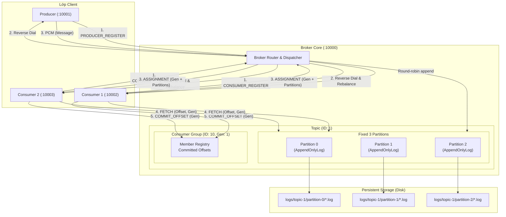
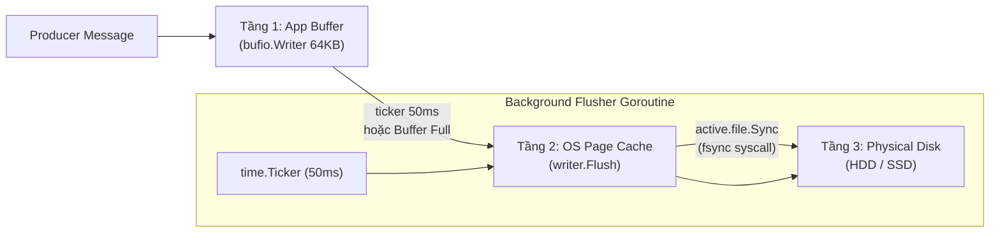
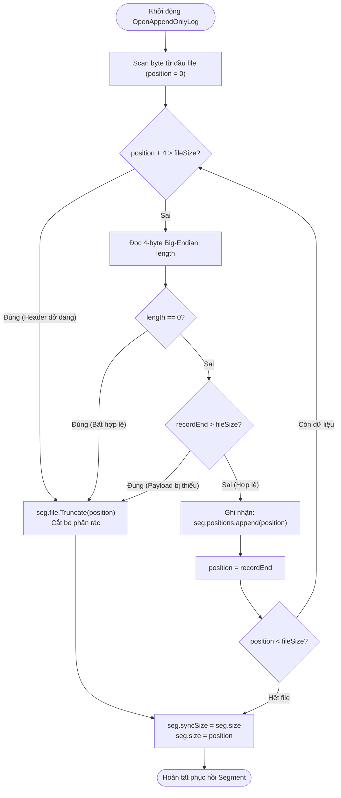
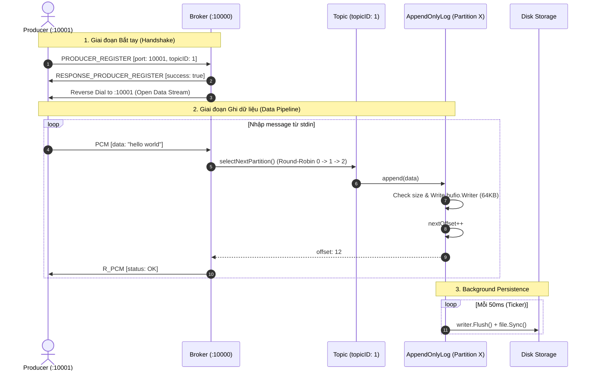
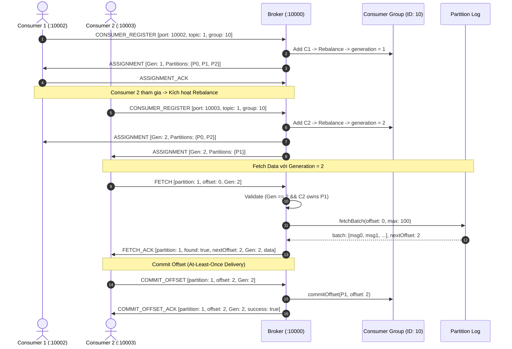
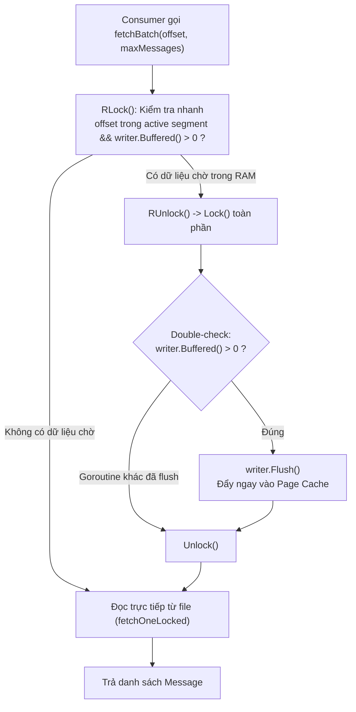

# DistributedMQ 🚀

[](https://golang.org)
[](https://kafka.apache.org)
[]()
[]()

**DistributedMQ** là một message queue phân tán hiệu năng cao, viết bằng Go, mô phỏng các cơ chế cốt lõi của **Apache Kafka** ở mức độ tối giản và trực quan. Dự án được thiết kế từ đầu (from scratch) nhằm mục đích nghiên cứu chuyên sâu về kiến trúc hệ thống phân tán, giao thức TCP nhị phân tùy biến (Custom Binary Framing Protocol), cơ chế lưu trữ phân đoạn bất biến (**Segmented Append-Only Log**), đồng bộ đĩa bất đồng bộ (**3-Tier Buffered I/O & Background Flusher**), kiểm soát thế hệ (**Generation-based Rebalance**) và an toàn đa luồng (**Concurrency & Thread-safety**).

---

## 📑 Mục lục

- [Tổng quan kiến trúc](#-tổng-quan-kiến-trúc)
- [Những thay đổi kỹ thuật mới (Deep Dive)](#-những-thay-đổi-kỹ-thuật-mới-deep-dive)
  - [1. Chuyển đổi từ Ring Buffer sang Disk-Based Append-Only Log](#1-chuyển-đổi-từ-ring-buffer-sang-disk-based-append-only-log)
  - [2. Pipeline ghi 3 tầng & Cơ chế Background Flusher](#2-pipeline-ghi-3-tầng--cơ-chế-background-flusher)
  - [3. Cơ chế Khôi phục Dữ liệu (Crash Recovery & Truncation)](#3-cơ-chế-khôi-phục-dữ-liệu-crash-recovery--truncation)
  - [4. Rebalance nhóm Consumer với Generation Validation](#4-rebalance-nhóm-consumer-với-generation-validation)
- [Sơ đồ luồng hoạt động (Workflow Diagrams)](#-sơ-đồ-luồng-hoạt-động-workflow-diagrams)
  - [Luồng gửi Message (Producer Publishing Flow)](#luồng-gửi-message-producer-publishing-flow)
  - [Luồng Consumer, Rebalance & Fetch Batch](#luồng-consumer-rebalance--fetch-batch)
  - [Cơ chế Flush khi Fetch (Smart Double-Checked Flush)](#cơ-chế-flush-khi-fetch-smart-double-checked-flush)
- [Giao thức TCP Nhị phân (Binary Protocol)](#-giao-thức-tcp-nhị-phân-binary-protocol)
- [Cấu trúc Thư mục & Mã nguồn](#-cấu-trúc-thư-mục--mã-nguồn)
- [Cài đặt & Hướng dẫn sử dụng](#-cài-đặt--hướng-dẫn-sử-dụng)
- [Mô hình Concurrency & Đồng bộ dữ liệu](#-mô-hình-concurrency--đồng-bộ-dữ-liệu)
- [So sánh với Apache Kafka](#-so-sánh-với-apache-kafka)
- [Giới hạn & Hướng phát triển](#-giới-hạn--hướng-phát-triển)

---

## 🏛 Tổng quan kiến trúc

DistributedMQ xây dựng mô hình mạng hai chiều (Bidirectional TCP Handshake):
1. **Producer / Consumer** khởi tạo TCP listener tại một port cục bộ, sau đó kết nối đến Broker (:10000) để đăng ký (Handshake Registration).
2. **Broker** tiếp nhận thông tin và chủ động kết nối ngược lại (`net.Dial`) tới port client đã đăng ký để thiết lập kênh truyền dữ liệu chính (Data Stream).



---

## 🔍 Những thay đổi kỹ thuật mới (Deep Dive)

Phiên bản cập nhật mang lại những cải tiến mang tính kiến trúc nền tảng, đưa DistributedMQ từ một bộ đệm ram thử nghiệm trở thành một message log engine bền vững:

### 1. Chuyển đổi từ Ring Buffer sang Disk-Based Append-Only Log

Trước đây, message được lưu tạm trong bộ nhớ RAM (`queue.go` dùng Ring Buffer). Nếu tiến trình broker tắt, toàn bộ dữ liệu biến mất.

Hiện tại, hệ thống sử dụng kiến trúc **Segmented Append-Only Log** (`appendOnlyLog.go`):
- **Cấu trúc phân cấp trên đĩa**: Mỗi partition sở hữu một thư mục riêng biệt:
  ```text
  logs/topic-<topicID>/partition-<partitionID>/
  ├── 000000000000.log    # Segment 1 (bắt đầu từ offset 0)
  ├── 000000000150.log    # Segment 2 (bắt đầu từ offset 150)
  └── 000000000300.log    # Active Segment hiện tại (bắt đầu từ offset 300)
  ```
- **Quy tắc đặt tên 12 chữ số (`zero-padded`)**: Tên file định dạng `%012d.log` dựa theo `baseOffset`. Khi broker quét thư mục log bằng `os.ReadDir()`, việc sắp xếp chuỗi alphabet thông thường (`sort.Strings`) đồng nhất tuyệt đối với thứ tự tăng dần theo offset thời gian.
- **In-Memory Byte Index (`positions []int64`)**:
  - Mỗi segment lưu trữ mảng chỉ mục vị trí byte trong RAM.
  - Khi consumer yêu cầu đọc offset $O$, broker tính `index = O - segment.baseOffset` và truy xuất vị trí byte `positions[index]` chỉ trong $O(1)$.
  - Sử dụng syscall `os.File.ReadAt(buf, position)` giúp đọc ngẫu nhiên mà không cần di chuyển con trỏ file (`Seek`), an toàn tuyệt đối cho nhiều consumer đọc đồng thời.
- **Cơ chế Roll Segment tự động (`rollSegment`)**:
  - Kích thước tối đa mỗi segment: `10 MiB` (`maxSegmentSize = 10 * 1024 * 1024 bytes`).
  - Khi một message mới khiến kích thước segment vượt ngưỡng, broker lập tức:
    1. `Flush()` buffer của active segment cũ.
    2. Gọi `file.Sync()` đưa toàn bộ dữ liệu xuống đĩa.
    3. Giải phóng bộ đệm RAM của segment cũ (`seg.writer = nil`).
    4. Tạo file segment mới với `baseOffset = nextOffset` làm active segment.

### 2. Pipeline ghi 3 tầng & Cơ chế Background Flusher

Để đạt được throughput cao tương tự Kafka mà không làm nghẽn luồng ghi chính (Append Latency), cơ chế **3-Tier I/O Pipeline** được triển khai:



| Tầng I/O | Thành phần kỹ thuật | Cơ chế & Tác dụng |
| :--- | :--- | :--- |
| **1. Application Buffer** | `bufio.NewWriterSize(file, 64*1024)` | Bộ đệm RAM 64KB của Go. Gom nhiều message nhỏ lại để giảm số lần gọi kernel syscall. |
| **2. OS Page Cache** | `writer.Flush()` | Đẩy dữ liệu từ bộ đệm Go sang Page Cache của hệ điều hành. |
| **3. Physical Storage** | `os.File.Sync()` (`fsync`) | Ép hệ điều hành ghi toàn bộ khối dữ liệu bẩn (dirty pages) xuống ổ cứng vật lý. |

> [!NOTE]
> **Graceful Shutdown & Đóng gói an toàn**:
> Khởi chạy background flusher độc lập qua goroutine. Khi đóng log (`log.Close()`), hệ thống kích hoạt kênh `stopFlusher chan struct{}`, chờ `flusherDone` phản hồi qua `sync.Once`, đảm bảo mọi byte tồn đọng đều được đẩy xuống đĩa trước khi đóng file descriptor.

### 3. Cơ chế Khôi phục Dữ liệu (Crash Recovery & Truncation)

Nếu broker bị tắt đột ngột (mất điện, crash hệ thống) khi file đang được ghi dở, segment có thể chứa các byte dữ liệu không hoàn chỉnh. Hàm `recoverSegment(seg)` tự động phát hiện và khắc phục:



### 4. Rebalance nhóm Consumer với Generation Validation

Nhằm ngăn chặn triệt để tình trạng **Zombie Consumer** hoặc **Split-brain** (khi consumer cũ chưa kịp cập nhật trạng thái rebalance vẫn tiếp tục fetch/commit dữ liệu chồng chéo lên consumer mới):

- Mỗi `ConsumerGroup` sở hữu một trường phiên bản `generation uint32`.
- Mỗi khi có Consumer tham gia hoặc rời khỏi nhóm:
  1. Broker tính toán lại phân bổ partition theo thuật toán Round-Robin: `consumerIDX = partitionIndex % len(consumers)`.
  2. Tăng số thế hệ: `cg.generation++`.
  3. Gửi thông điệp `ASSIGNMENT` chứa `generation` mới đến tất cả Consumer.
- **Strict Validation ở Broker**:
  - Gói tin `FETCH` và `COMMIT_OFFSET` từ client bắt buộc phải mang trường `generation`.
  - Broker kiểm tra:
    ```go
    if resp.FETCH.generation != cgroup.generation {
        // Từ chối request do stale generation!
    }
    ```
  - Đồng thời kiểm tra phân quyền: Consumer chỉ được phép đọc/ghi partition mà nó đang sở hữu trong thế hệ hiện tại.

---

## 🔄 Sơ đồ luồng hoạt động (Workflow Diagrams)

### Luồng gửi Message (Producer Publishing Flow)



### Luồng Consumer, Rebalance & Fetch Batch



### Cơ chế Flush khi Fetch (Smart Double-Checked Flush)

Khi một Producer vừa ghi message nhưng flusher định kỳ 50ms chưa chạy, Consumer gửi lệnh `FETCH` ngay lập tức có thể bị lỡ message nếu dữ liệu vẫn đang nằm trong RAM buffer của Go. DistributedMQ giải quyết bằng cơ chế **Double-Checked Flush**:



---

## 📦 Giao thức TCP Nhị phân (Binary Protocol)

DistributedMQ sử dụng định dạng khung nhị phân chuẩn Big-Endian:

```text
+-----------------------+-------------------+-----------------------------------+
|  Length (4 Bytes)     |   Type (1 Byte)   |        Payload (N Bytes)          |
|      uint32           |       uint8       |        Tùy theo loại Frame        |
+-----------------------+-------------------+-----------------------------------+
```

- `Length`: Độ dài tính bằng byte của `Type` (1 byte) + `Payload` ($N$ bytes).
- `Type`: Mã định danh opcode của thông điệp.
- `Payload`: Dữ liệu được encode nhị phân chi tiết.

### Bảng tra cứu Message Types

| Opcode | Tên Thông điệp | Hướng truyền | Cấu trúc Payload |
| :---: | :--- | :--- | :--- |
| `1` | `ECHO` | Client $\rightarrow$ Broker | `data: []byte` |
| `101` | `RESPONSE_ECHO` | Broker $\rightarrow$ Client | `data: []byte` |
| `2` | `PRODUCER_REGISTER` | Producer $\rightarrow$ Broker | `port: uint16`, `topicID: uint16` |
| `102` | `RESPONSE_PRODUCER_REGISTER` | Broker $\rightarrow$ Producer | `success: bool` |
| `3` | `PCM` (Produce Client Message) | Producer $\rightarrow$ Broker | `data: []byte` |
| `103` | `R_PCM` | Broker $\rightarrow$ Producer | `status: uint8` (0 = OK) |
| `4` | `CONSUMER_REGISTER` | Consumer $\rightarrow$ Broker | `port: uint16`, `topicID: uint16`, `groupID: uint16` |
| `104` | `RESPONSE_CONSUMER_REGISTER` | Broker $\rightarrow$ Consumer | `success: bool` |
| `6` | `ASSIGNMENT` | Broker $\rightarrow$ Consumer | `count: uint16`, `gen: uint32`, `[partitionID: uint16, offset: uint32]...` |
| `105` | `ASSIGNMENT_ACK` | Consumer $\rightarrow$ Broker | `success: bool` |
| `7` | `FETCH` | Consumer $\rightarrow$ Broker | `partitionID: uint16`, `offset: uint32`, `generation: uint32` |
| `106` | `FETCH_ACK` | Broker $\rightarrow$ Consumer | `partID: uint16`, `found: bool`, `errCode: uint8`, `nextOffset: uint32`, `gen: uint32`, `data: [len: uint16, payload]...` |
| `5` | `COMMIT_OFFSET` | Consumer $\rightarrow$ Broker | `topicID: uint16`, `groupID: uint16`, `offset: uint32`, `partitionID: uint16`, `gen: uint32` |
| `107` | `COMMIT_OFFSET_ACK` | Broker $\rightarrow$ Consumer | `partID: uint16`, `offset: uint32`, `gen: uint32`, `success: bool` |

---

## 📂 Cấu trúc Thư mục & Mã nguồn

```text
d:/kafka/
├── appendOnlyLog.go     # Core Storage Engine: Segment, Positions RAM Index, Flush, Recover
├── broker.go            # Central Broker: TCP Server, Routing, Fetch/Commit dispatcher
├── cgroup.go            # Consumer Group: Quản lý Member, Rebalance, Generation, Offset State
├── consumer.go          # Client Consumer: Event Loop, Assignment, Batch Processing & Commit
├── producer.go          # Client Producer: Stdin loop, TCP Frame Dispatcher
├── topic.go             # Quản lý 3 Partitions cố định, Round-robin routing
├── partition.go         # Wrapper kết nối PartitionID với AppendOnlyLog thực tế
├── message.go           # Bộ mã hóa/giải mã nhị phân (Binary Framing Codec)
├── terminalUI.go        # Banner hiển thị log sự kiện chuẩn form chuyên nghiệp
├── kafka.go             # CLI Entrypoint với bộ điều hướng câu lệnh (broker/producer/consumer)
└── go.mod               # Khai báo Go Module (go 1.25.4)
```

---

## 🚀 Cài đặt & Hướng dẫn sử dụng

### Yêu cầu hệ thống
- **Go**: Phiên bản `1.22+` (khuyến nghị `1.25+`).
- Môi trường: Windows (PowerShell / CMD), Linux, hoặc macOS.

### Kịch bản Demo thực tế (Walkthrough)

Mở 4 cửa sổ terminal riêng biệt để trải nghiệm trọn vẹn luồng hoạt động:

#### Bước 1: Khởi động Broker (Terminal 1)
```bash
go run . broker
```
*Console output:*
```text
***** BROKER ONLINE *****
* Listening on :10000
* Topics initialized
* Waiting for producers and consumers
*****
```

#### Bước 2: Khởi động Consumer thứ nhất (Terminal 2)
Cú pháp: `go run . consumer <local_port> <topicID> <groupID>`
```bash
go run . consumer 10002 1 10
```
Broker sẽ gán toàn bộ 3 partition (`P0, P1, P2`) cho Consumer 1 (Generation 1).

#### Bước 3: Khởi động Consumer thứ hai để kích hoạt Rebalance (Terminal 3)
```bash
go run . consumer 10003 1 10
```
*Lập tức Broker kích hoạt Rebalance (Generation tăng lên 2):*
- Consumer 1 nhận: `P0, P2`
- Consumer 2 nhận: `P1`

#### Bước 4: Khởi động Producer và gửi dữ liệu (Terminal 4)
Cú pháp: `go run . producer <local_port> <topicID>`
```bash
go run . producer 10001 1
```
Nhập bất kỳ dòng văn bản nào vào terminal Producer và nhấn `Enter`:
```text
Order #1001 created
Payment #2002 processed
Email notification queued
```

*Quan sát:*
- Broker nhận message, chia đều vào 3 partition theo Round-robin.
- Message được ghi vào file segment đĩa vật lý dưới thư mục `logs/topic-1/`.
- Consumer 1 và Consumer 2 fetch các batch tương ứng, in kết quả ra màn hình và gửi `COMMIT_OFFSET` xác nhận.

---

## 🔒 Mô hình Concurrency & Đồng bộ dữ liệu

DistributedMQ chú trọng tính toàn vẹn dữ liệu trong môi trường đa luồng:

1. **Stale Generation Prevention**:
   - Sử dụng kiểm tra hai chiều giữa Broker và Consumer Group. Mọi request không khớp `generation` sau khi Rebalance đều bị drop an toàn.
2. **Fine-grained Locking**:
   - `sync.RWMutex` được sử dụng độc lập ở từng tầng: `Topic.mu` cho việc round-robin routing; `ConsumerGroup.mu` cho việc quản lý danh sách thành viên và commit offset; `AppendOnlyLog.mu` bảo vệ danh sách segment và con trỏ `nextOffset`.
3. **Double-Checked Locking**:
   - Giảm thiểu tranh chấp lock ghi trong `fetchBatch` bằng cách dùng `RLock` kiểm tra trước điều kiện buffer, chỉ thăng hạng lên `Lock` khi thật sự cần `Flush`.
4. **Race Detector Verified**:
   Dự án được kiểm thử định kỳ bằng Go Race Detector:
   ```bash
   # Trên PowerShell:
   $env:CGO_ENABLED=1; go test -race ./...
   
   # Trên Linux/macOS:
   CGO_ENABLED=1 go test -race ./...
   ```

---

## ⚖ So sánh với Apache Kafka

| Tính năng | Apache Kafka | DistributedMQ |
| :--- | :--- | :--- |
| **Storage Engine** | Append-Only Commit Log trên đĩa | Append-Only Segmented Log trên đĩa |
| **Log Segmenting** | Chia theo kích thước (1GB) hoặc thời gian | Chia theo kích thước (mặc định 10MB) |
| **Indexing** | File index `.index` và `.timeindex` riêng | Mảng `positions []int64` nạp thẳng trong RAM |
| **I/O Buffering** | Dựa hoàn toàn vào Linux OS Page Cache | `bufio.Writer` (64KB) + Periodic Background Flusher + Page Cache |
| **Consumer Model** | Pull-based (Consumer chủ động Fetch) | Pull-based (Consumer chủ động Fetch theo Batch) |
| **Consumer Rebalance**| Dynamic Group Coordinator (Kafka Protocol) | Round-Robin Rebalance kèm Generation Counter |
| **Delivery Semantics**| At-least-once, At-most-once, Exactly-once | **At-least-once** (Fetch $\rightarrow$ Process $\rightarrow$ Commit Offset) |
| **Offset Storage** | Lưu trong Topic nội bộ `__consumer_offsets` | Lưu trong RAM Broker (`ConsumerGroup.offset`) |
| **Cluster & HA** | Phân tán nhiều Broker, Raft / KRaft, Replication | Single-broker (Thiết kế cho môi trường học tập) |

---

## 🛠 Giới hạn & Hướng phát triển

> [!IMPORTANT]
> Dự án được xây dựng với mục tiêu giáo dục và nghiên cứu kiến trúc hệ thống. Một số tính năng phục vụ môi trường Production đang được tiếp tục hoàn thiện:

- [ ] **Lưu trữ Offset bền vững (Offset Persistence)**: Lưu committed offset của consumer group xuống file log hoặc cơ sở dữ liệu thay vì RAM.
- [ ] **Log Retention & Compaction**: Cơ chế tự động dọn dẹp (xóa các segment cũ theo thời gian hoặc dung lượng vượt ngưỡng).
- [ ] **Heartbeat & Session Timeout**: Cơ chế phát hiện Consumer bị treo/crash thông qua gói tin Ping/Heartbeat định kỳ.
- [ ] **Dynamic Partitioning**: Cho phép người dùng tùy biến số lượng partition khi tạo topic.
- [ ] **Bảo mật**: Tích hợp TLS/mTLS cho các kết nối socket TCP.

---

## 📄 License

Dự án phát hành theo giấy phép học tập và mã nguồn mở. Đóng góp ý kiến và Pull Requests luôn được chào đón!
